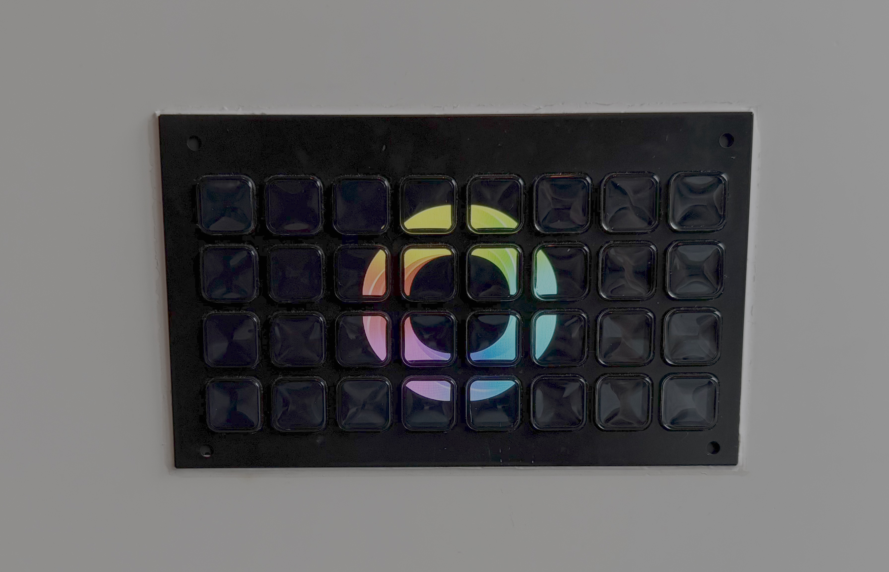
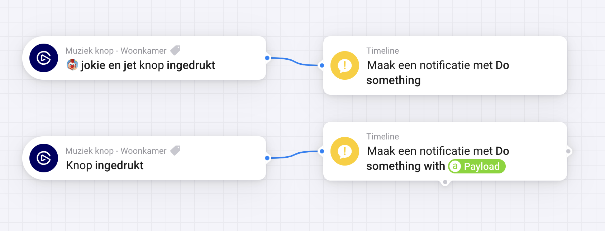
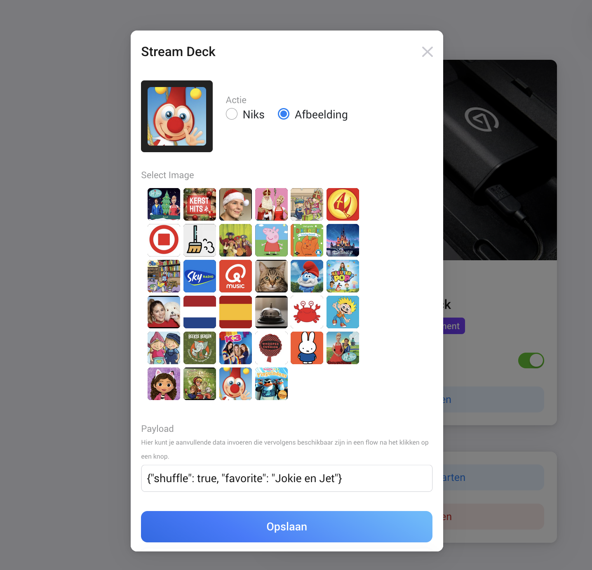
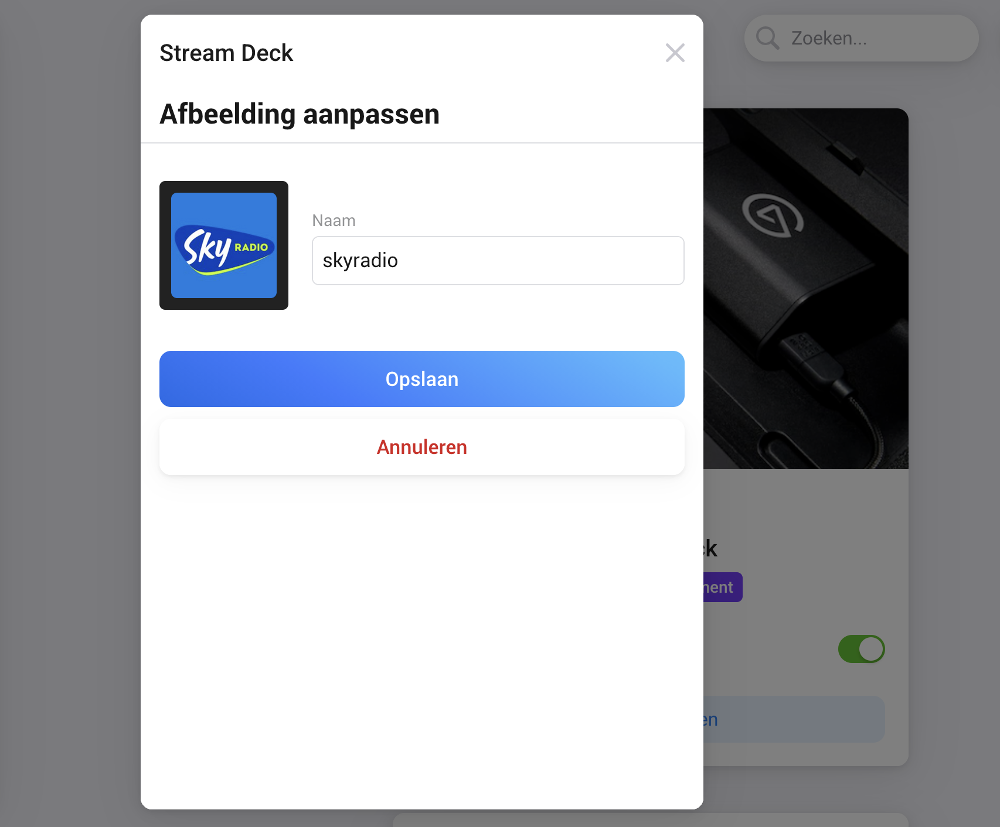

# Stream Deck

Control Homey from your Stream Deck

**Download:** 
Stable version: [Stream Deck | Homey](https://homey.app/a/nl.stefanrenne.streamdeck) 
Test version: [Stream Deck | Homey](https://homey.app/a/nl.stefanrenne.streamdeck)

## Requirements:
- Stream Deck Studio
- Stream Deck Network Dock, with one of the following devices:
	- Stream Deck Module 6
	- Stream Deck Module 15
	- Stream Deck Module 32
	- Stream Deck Mini
	- Stream Deck Classic
	- Stream Deck Scissor Keys
	- Stream Deck XL
	- Stream Deck neo (only lcd buttons supported)
	- Stream Deck + (only lcd buttons supported)

## Flow:
Act on specific button presses or process a send payload

Navigate between dashboards

Toggle your streamdeck

## Configuration:
In the app's settings screen you can upload images and create dashboards, you can even set a payload that needs to be send on button press.

List and manage dashboards:

Create / Edit dashboard:

Update dashboard item:

List and manage images:

Edit image:

